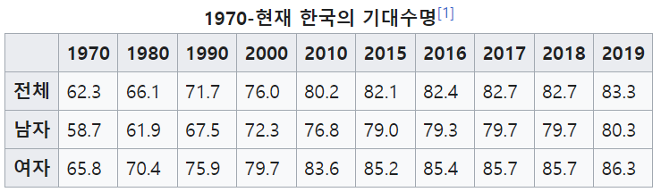
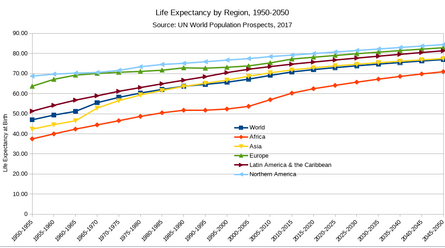
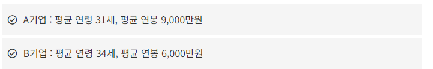
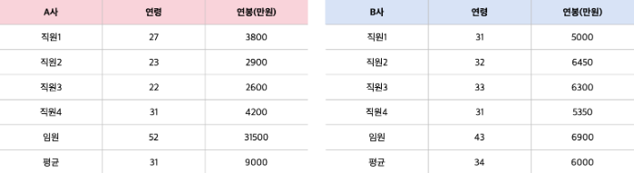
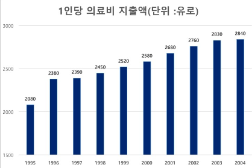

# 누워서 보는 통계학 0장

### 통계학이란 ?

어떤 사항에 대한 경향과 특징을 알기 위해서 우선 관측이나 조사, 실험을 통해 데이터를 수집한다.
이때 통계학은 "수집한 데이터를 정리하는 방법"과 "데이터를 분석하고 여기에서 새로운 지식을 찾아내는 기술" 두 가지를 제공하는 학문이다.

예를 들면, 평균 수명이 시간이 지나면서 어떻게 변화했는지 알기 위해서는 매년 발표되는 평균 수명을 표로 정리할 수 있고, 다시 그래프로 정리 할 수 있다.
아래 표와 그래프로 보았을 때, 평균 수명이 매년 증가하는 것을 알 수 있고 5년 뒤, 10년 뒤의 예상 평균 수명을 예측할 수 있다.

### 통계의 거짓말

1. 심슨의 역설은 "여러 집단으로 이루어진 데이터를 전체로 합쳐서 분석했을 때의 결과가 개별 집단을 따로 분석했을 때의 결과와 상반되게 나타나는 현상" 이다.
대표적으로 "의사 1"이 완치시킬 확률 30% 이고 "의사 2"가 완치시킬 확률 60% 라고 했을 때, 의사 2가 더 훌륭한 의사로 보일 수 있지만 의사 2가 의사 1보다 쉬운 수술을 많이 했다면 이 통계는 상반되는 혹은 잘못된 정보를 줄 수 있다. 

2. 평균의 함정. 

일 때, A 기업이 사원 연령이 젊고 연봉도 많은 것으로 볼 수 있지만 

3. 아래 그래프를 보면 y축을 절삭하여, 10년동안 의료비 지출액이 2배가 오른 것과 같은 착각을 일으킨다. 

결론은

| <B>통계를 보면 '누가, 무엇을 위해, 어떻게 만들었는가'를 항상 생각해야 한다. </B>

통계학을 공부하고 이를 생각하면 통계를 올바르게 볼 수 있고 잘못된 통계로 인한 잘못된 판단을 줄일 수 있을 것이다.
